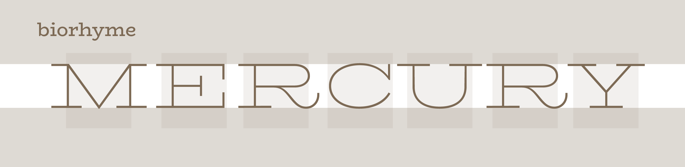

# BioRhyme Fonts

A slab serif family loosely based on Boston Breton and a sample 'R' from a Conner's type foundry specimen, by Aoife Mooney. 

* [Download v1.600](https://github.com/aoifemooney/makingbiorhyme/releases/download/v1.600/BioRhyme-v1.600.zip)
* [Development PDF](https://github.com/aoifemooney/makingbiorhyme/blob/gh-pages/Development/Proofs/Art/BioRhyme_ALL_V55.pdf) ([direct download](https://github.com/aoifemooney/makingbiorhyme/raw/gh-pages/Development/Proofs/Art/BioRhyme_ALL_V55.pdf))
