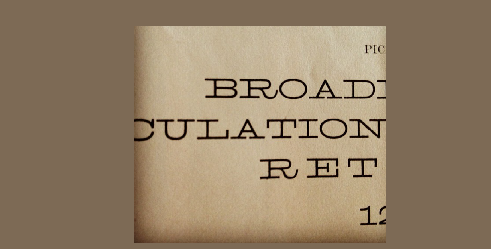
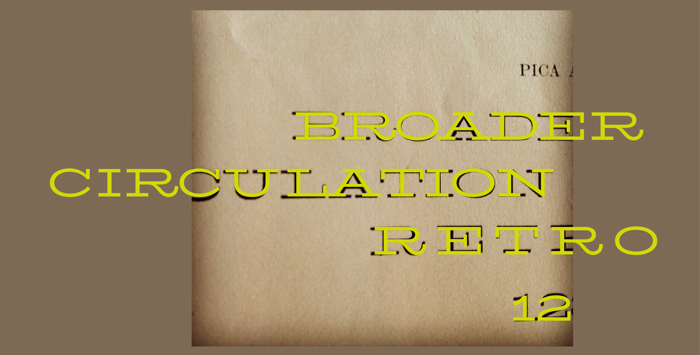
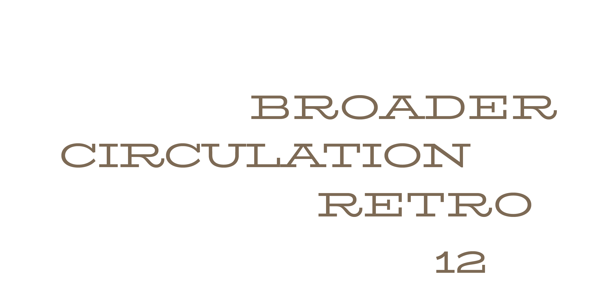
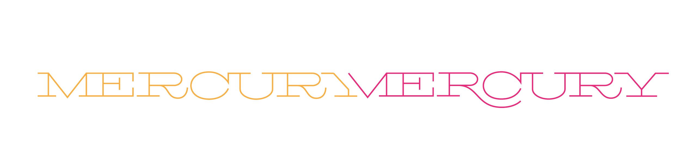
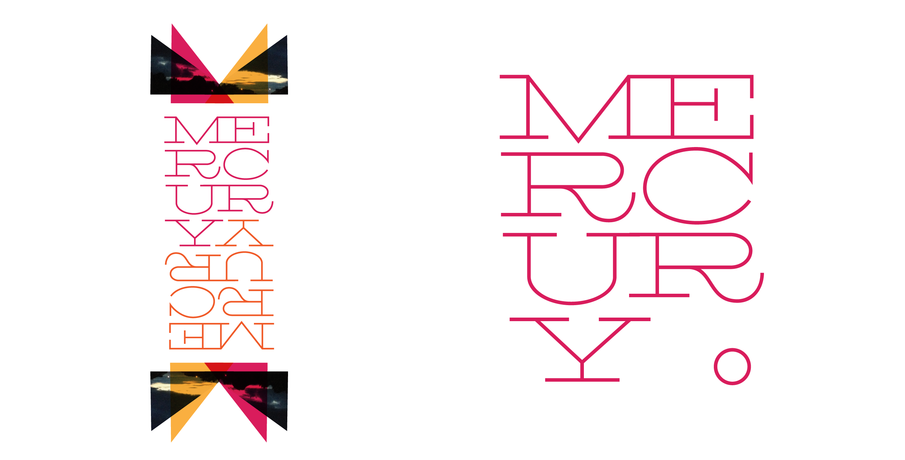
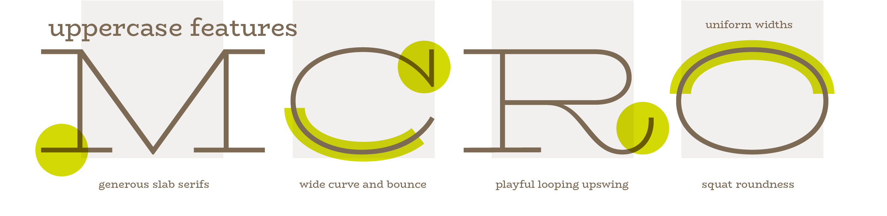
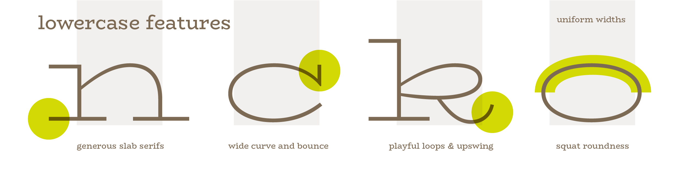
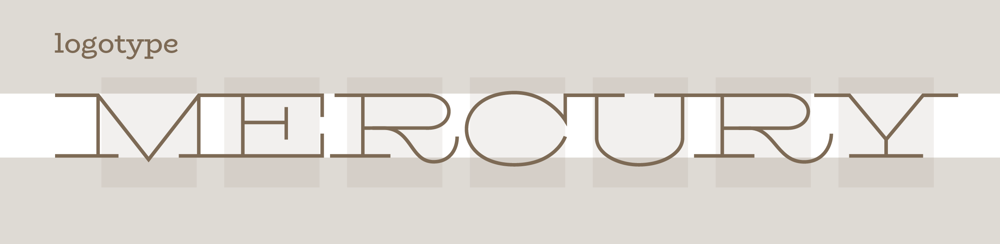
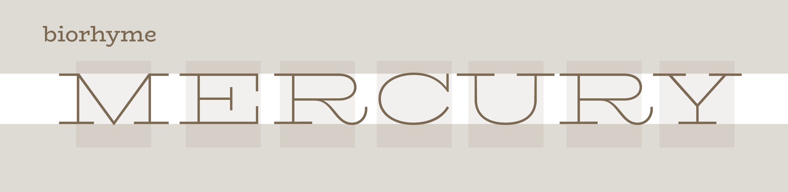

Biorhyme started life as a logotype for a musical duo called Mercury Mercury. The idea for the logotype started with an ‘R’ I found in a Conner’s type foundry specimen book and fell in love with. I had it in my back pocket and was waiting to find a use for it. 

When I started to work on the logo for Mercury Mercury, it seemed to fit the needs of the brief. The logo was intended to show an organic and evocative approach to music combined with a systematic and methodical and primarily digital workflow. There are many ways of approaching this kind of brief, and indeed most typefaces consist of a balance of these very concepts, with a requirement for modularity and mechanical consistency to be harmonized with the requirement for expression and identity. 

Kris Holmes describes this interplay beautifully in the Tufte produced documentary about Inge Druckrey Teaching to See, where she describes the relationship between the eye, who desires order, regularity and rhythm, and the hand that translates thoughts into the written word, whose main impetus is toward movement and expression — ‘the radical hand’ she calls it. In any typeface there is the record of this movement. Even in the most geometric and modular of typefaces, the requirement for recognizability is dictated by the conventions our eyes have become accustomed to expect. These are largely grounded in these precursor skeletal models and constituted as conventions in each new typeface and thoroughly rooted in the earliest forms of our alphabet in inscriptions, carvings and bookhands of the pre-moveable type eras.
 
That being said, I decided it was time to dust off my little pet project, since I thought that the lean weight of the form and the playful kick of the leg on the R was a nice approach to take to express this concept, although this is only one of a myriad possibilities. So I pulled out my little shot of the R, and began working on the other letters of the word Mercury. I developed an identity system around these letterforms, and handed it over as a finished logotype.

I left it there for a while, until l had an idea to see what a lowercase would look like for this typeface. 

Once I had started that, got to thinking about how this single style could be built upon to create a more useful family. The idea for this, came from an ongoing preoccupation with expression in typography. I wanted to build out this very expanded, very light weight into a family that would include a regular width, regular weight version, allowing the user to be playful and dramatic in one, and purposeful and to the point in the other. While I was in the middle of this process, the opportunity to create a documentation of the process of making a typeface arose, and I decided BioRhyme would be a good fit for this purpose, covering a lot of the main factors and considerations involved in making a typeface. 

Type designs are regularly born out of a logotype, and even more regularly families are built based on a client-led project resulting in some weights that then lend themselves to expansion into a fuller typographic range. Couple this with the need for this type family to work on screen, and the fact that I wanted to use interpolation as a design tool, and the type seemed to fit the brief of being an educational example.
 
I will admit straight off the bat, I am not the most methodical of workers, or at least not the most tidy! The process of getting BioRhyme to completion is more of a circling pattern than a linear trajectory, but I would argue this is not thoroughly unusual for all but the most seasoned of type designers. In my meagre experience, the process always includes doubling back, side-stepping, and last minute design decisions, in spite of all best practices and laid plans.
 
With this in mind, my objective with this site is to be as open about my confusion and indecision as I am about the logical and methodical steps I have taken. I will endeavor to always include links to relevant literature I might have consulted, or have referenced in my typographic education that might be useful to the novice designer. If there is anything that is unclear, or you would like to pick a bone with me about, please feel free to get in touch. I will be happy to correct any errors, provide more information, or connect readers with better resources.
 
I will proceed in chronological order, aiming to pull-out micro discussions as I go along where they might be insightful.