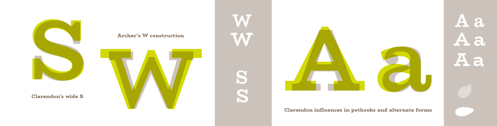
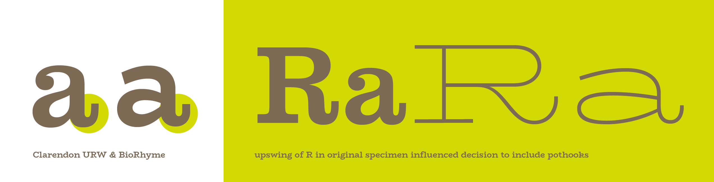

Design concepts in typeface design are particularly abstract things. In *graphic design* we use a combination of typeface choice, alignments, balance of negative space, color and form to create moods and identities. Typeface design, by contrast, is a black and white, figure/ground art. 

Although there are many chromatic typefaces and—most delightfully—[now software](https://glyphsapp.com/tutorials/creating-a-layered-color-font) that supports the design and contiguous previewing of multi-color typefaces like this lovely one from [The Colour Grey](http://www.thecolourgrey.com/sodabudi.html), these are still conceived as positive and negative relationships, with color applied as a preview of what might be, rather than a definitive or final state for the typeface. 

Typefaces change mood and tone of voice as we make use of them in different contexts, and so defining a personality or concept for a typeface can be more a game of strategy and abstract thinking than of defining a final outcome. It is the nature of typefaces to adapt, to flex to the nuance of the material they set, and, most importantly, to serve their users. 

Typefaces, as products of design processes, are also perhaps unusually user-oriented as design products in their service to two kinds of users, the typographer, or manipulator of the text, and the reader, participant in the reading process. 

For this reason, in defining a conceptual basis for a typeface design, it is useful to start with its potential uses, alongside its potential range of expression, and to do the former in specific terms and the latter in abstract terms. (For example: Uses; magazine setting, ranging from caption to display with long-reading text and tabular figures for charts. Expression; friendly, fresh, no-nonsense, quirky, warm etc.) 

We do not yet have a typology of the formal characteristics of typefaces, and what their micro combinations can evoke, and so deciding on how and what to imbue a flavor with within the parameters of the shape language of type, can seem daunting at best. However, we can look to precedents, assessing in each what it is in the shapes that define the typeface’s mood, atmosphere, flavor, personality or tone. It is easy to fall into the trap of thinking round shapes equal soft and friendly faces, and that square shapes equal more sturdy, upright and strong forms, but this is a narrow and limiting approach that is almost guaranteed to fail.

In any typeface, there are two levels of form at work: the micro and the macro. The micro has to do with things like the shape of the serifs, terminals and hooks, and the macro has to do with the roundness of the bowls, arches, counters and the large-scale proportional features like width, weight and rhythm. It is in the combination of shape elements that a personality is born, and more often it is the relationship between the sharp geometric forms and the curvilinear elements which defines the personality, and not one to the exclusion of the other, or one generalizing principle applied at both levels. For this reason it can be useful to choose historical or genre models to work with, for specific personality traits, and models for specific contexts or purposes, and carefully pull together a set of decisions that build to make a cumulative communicative effect. 

Leslie Atzmon’s writings on the rhetorical content of typefaces seems worth pointing to [here](http://www.eyemagazine.com/blog/post/visual-rhetoric). Since all typefaces rely on convention, and our conventions are built on the work of predecessors, historical models will always be a useful point of reference, and designs for specific sizes particularly so if you are making a revival typeface. 

Using classifications or genres is also incredibly helpful in defining what general category your typeface will fit into, or bridge gaps between. For example, you could look at both Clarendons and Geometric sans-serifs, and each will give you cues to work with if you want to create a typeface that fuses the flavor, context or scale of one or the other or both. 

More and more type design is seeing a breaking down of the traditional classification models, and hybrids are becoming the norm. For an interesting example of a hybrid, check out Martin Wenzel's fresh and quirky [Ode typeface](http://www.martinplusfonts.com/ode/). However, the prevalence of hybrids does not at all invalidate the need for [classificatory descriptions](https://medium.com/type-class-tuesdays/the-vox-atypi-system-51b409cdcd5e#.t5wi13m7t) of the conventions our current typographic practice is based on, and researching the history of the genre(s) you seek to serve will only be helpful.