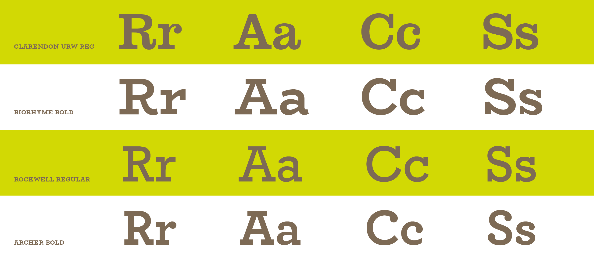
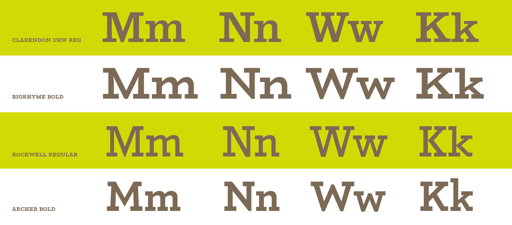
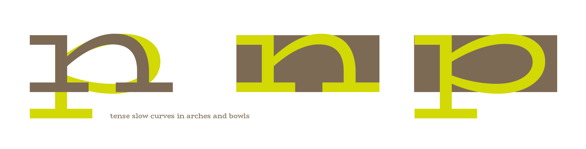
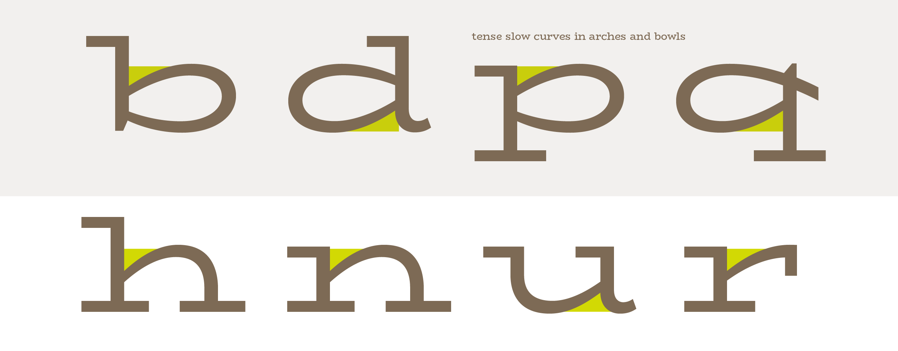
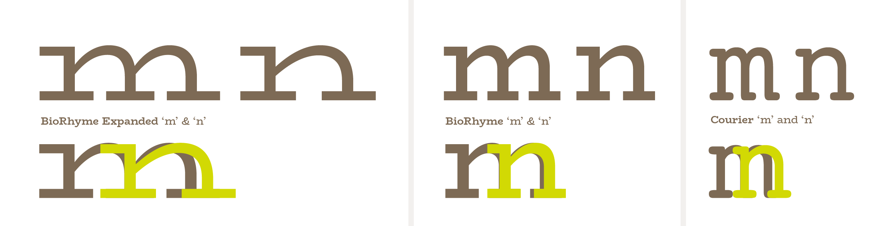
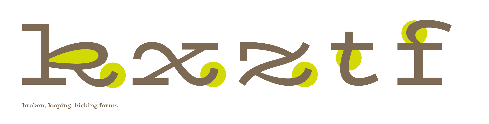
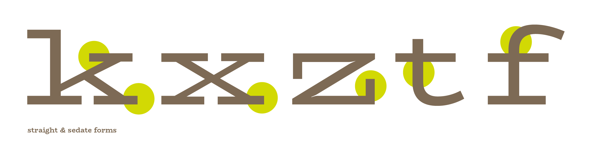
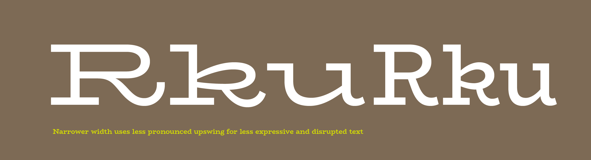
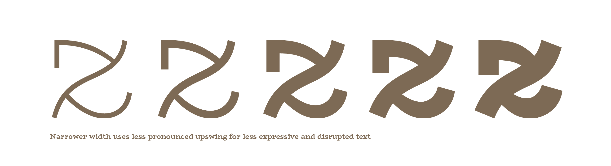
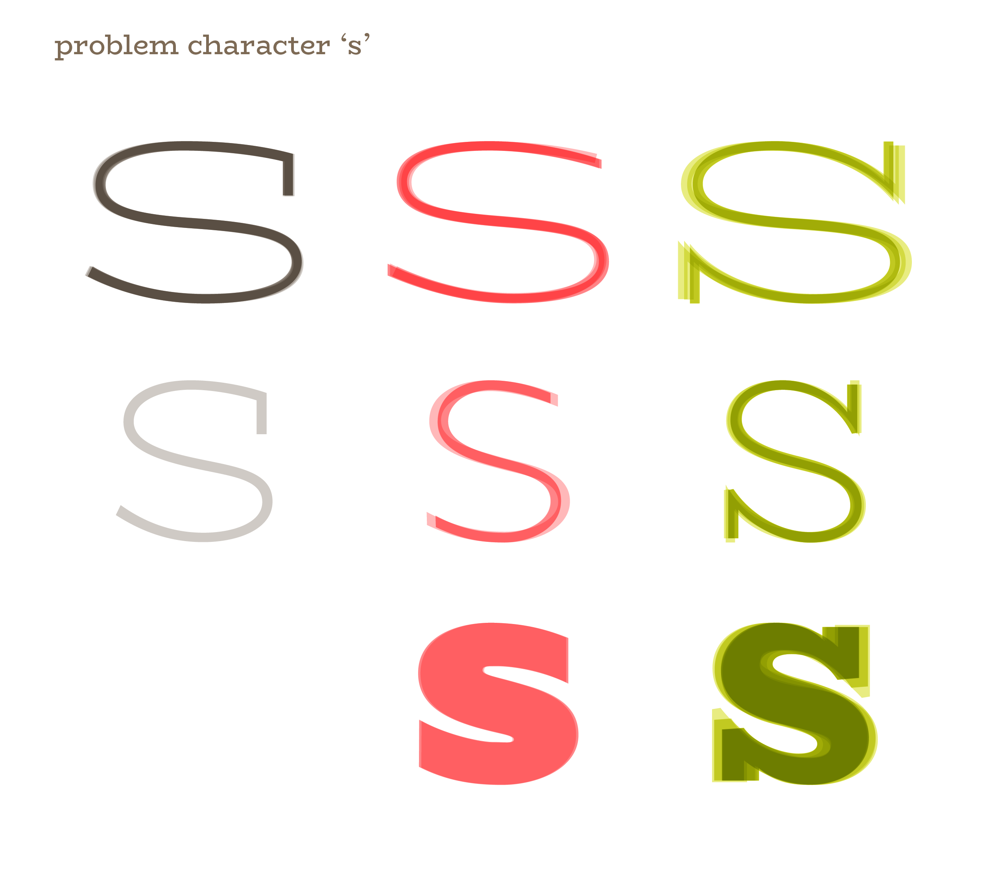

There is a conundrum in the Latin alphabet, and that is that the forms of our upper and lower cases are derived from different historical precedents. Never originally conceived to work together, all typefaces with both cases aim to harmonize and blend two different models of proportion and manual tradition. 

**Our lowercase letters** are derived from the bookhands of the monasteries—the scribes and the calligraphers—from the broad nibbed pen, and later influenced by the pointed, pressure-sensitive pens of the Italian renaissance calligraphers. 

**Our uppercase letters**, on the other hand, are derived from inscription models, with limited stroke elements of the diagonal, curve and straight. Letters were painted and then incised into stone, theoretically providing us with our first serifs (Catich). From this basis in inscription and geometry, two approaches to the proportion of these letters have evolved. 

First is a classical set of proportions, based on the aforementioned square capitals of the roman period, and later, a more uniform width evoking the mecaniques typefaces of the early 19th century. These aim for a uniformity in width of the uppercase, compromising the ratios of the classical models into a more industrial ‘regularized’ approach. 

In the creation of the logotype for Mercury Mercury, I ended up creating a set of very similar width capitals, in the pursuit of creating an even and balanced word shape. The E was not as narrow as an E would be in classical proportions in comparison to the M, and the R also approached the width of the U, a relationship much more closely aligned with a mechanical, rational design language.
 
Proportions and personality: Influences
Having established that this was part of the identity of the parent logotype, and one I wanted to keep in the related typeface family, I decided to carry the mono-width tendency further, and attempt to imbue the lowercase letters with this same character. However, it was important to me that I didn’t want this typeface to feel mechanical, so I looked to the warmest mono-width sources I could for inspiration. I looked to the typewriter and to distinctly warm and characterful slab serifs like the Clarendons and and Scotch Romans. I wanted to evoke something of an archaic sweetness, a sort of hybrid office-use and personal letter-writing, and combine it with a more edgy, clean and crisp finish. 

<figcaption>Influences in forms of R, A, C, S</figcaption>

<figcaption>Influences in forms of M, N, W, K</figcaption>

I played with the bowls of the bdpq to make round but tense curves, to continue those in the uppercase, and aimed for generous arches to match the width of the bowls. 

<figcaption>Arches and bowls share widths and slow, tense curves in shoulders and bowls</figcaption>

<figcaption>Negative spaces at the baseline and x-height create a soft, bouncing rhythm</figcaption>

A particular nod to the typewriter genre can be seen in the lowercase ‘m’ which is much narrower than a proportionally adjusted ‘m’ would usually be. (Usually the m arches are marginally narrower than those of the ’n’ to optically cheat the relationship between the m and the n so that the m does not become sprawling, but sits comfortably, optically, alongside the proportions of the n.

<figcaption>A nod to the typewriter in a disproportionately narrow 'm'</figcaption>

I wanted the lowercase to feel squat like the uppercase, and as an experiment, I wanted to see how far could I push the width and squatness of a lowercase like this. So, I gave it short extenders and pushed the widths as far as I could so that its body would feel exaggerated and larger than life. 

There are some distinctive features in the lowercase, that get carried through to the other styles and weights later developed, which were established in this stage of the project. The lowercase ‘k’ ‘x’ ‘z’ ’t’ and the terminals of the ‘a’ ‘d’ and ‘u’ letterforms were all developed with more and less expressive versions. I kept the expressive k e and z as the defaults, but relegated the other options to either alternate status or removed them completely in the long run. 

<figcaption>Expressive kicks and loops</figcaption>

<figcaption>Straight and sedate forms</figcaption>

These quirkier shapes were intended to continue the playful quality of the uppercase R from the logotype, and also further a relationship between round and straight that I established with the bdpq. Here, there is a tension between the curve and the rigidity of the serif and uprights. 

<figcaption>Playful influence of the uppercase R in lowercase is moderated in narrower width</figcaption>

I wanted to keep this in the z, for example, so the slow curve in the spine meets tension points where the horizontals curve into the spine and taper substantially to create a point of connection.

<figcaption>Taut curves and tense connections in z mimic bowls and kicks of outstrokes elsewhere</figcaption>
 
Some problem characters in this typeface have been the s, w, R, Q and S. I really struggled to make a decision on the behavior of each of these, and particularly in the case of the S and s, these shapes are paramount in defining the overall form and flavor of a typeface by virtue of how many other glyphs relate to these, and how frequently they appear in common Western typesetting. I tried a version without serifs, a narrower version, a squarer version, a rounder version, longer serifs, shorter serifs, and so on and so forth. 

<figcaption>Development of the lowercase'S'</figcaption>

In the w, I tried criss-crossing the strokes, breaking at a certain point in the weight increase, I tried narrower, wider, heavier, lighter, more and less contrast, and eventually even removed the internal serif in the narrower widths. 

In each attempt, some feature found in another letterform in the typeface is being exploited to try to get the character to step into line with the others and play nice.