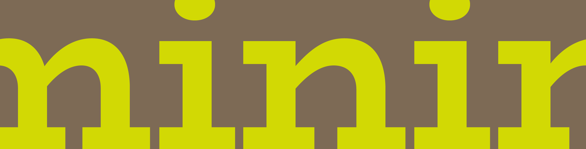
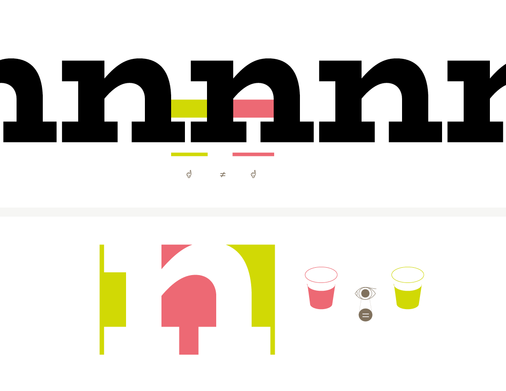
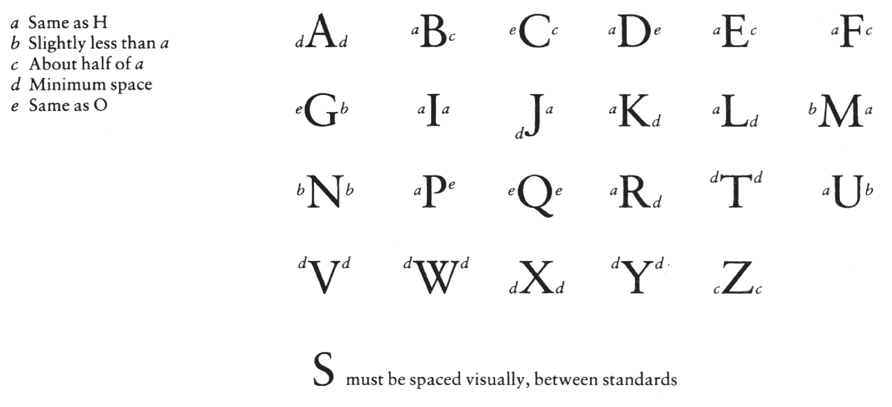
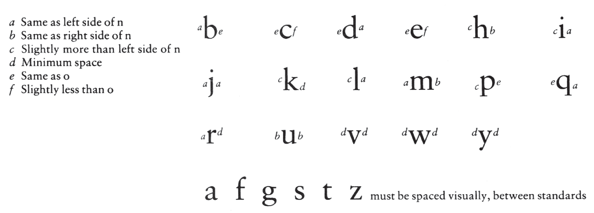

Spacing the extreme width and extremely light weight of BioRhyme Extended was tricky, so the more generalizable notes from this process are oriented around the narrower width which will be more easily translated to other typefaces. However, it is worth noting that the reason it is difficult to space a wide, light typeface is exactly the reason why it is important to space at all. When there is any weight in a letterform, there is an opposition immediately created between the foreground and the background of the shape, and between that shape and the ones before and after it. Balancing this distribution of black and white, is what makes or breaks the legibility and color of a typeface. 

There is a rule of thumb in typeface design that says that you can make a poorly drawn typeface work well with good spacing, but you can never make a beautifully drawn but poorly spaced set of letters function as a typeface. It is of paramount importance to get this rhythm right, because of how our eye perceives pattern. 

We need enough similarity between the forms for rhythm, and enough differentiation between them for recognition. Similarly, we need enough space between the letters to separate them from each other, and enough proximity to make them behave as words. 

With an extra light extra wide typeface it is hard to discern both the proper rhythm of stems—since they are so light—and the space between them, since the internal space is difficult to define with the subtle limits imposed by the stroke weight on the counter. I *think* I managed it here, but only after developing the bold weight and then interpolating the bold extended which was easier to space, and allowed me to cross check the decisions I made in the original lighter weight.

With spacing, you need to start with a set of standardizing characters. This is usually the ‘n’ and the ‘o’ in the lowercase, and the ‘H’ and the ‘O’ in the uppercase. These characters are the usual suspects because they are the closest thing to symmetrical you can get in the letters of the Latin alphabet, and in the case of the ‘n’ also have an aspect of their structure repeated substantially in other letters in the Latin alphabet, and is a frequent letter in language use patterns, as evidenced by lorem ipsum text, which you will notice has a predominance of round and arched letterforms. 

Because of the impact of this arch on the lowercase rhythm, a word that is often used in conjunction with these spacing standards, is ‘minimum’ and to the best of my knowledge, historically, this ‘minim’ also appeared in manuscript traditions, and was used to set the cadence of the forms, as with the minim in music. 

<figcaption>The word 'minimum' is used as a means to balance inner and outer counters and create a rhythmic repetition of the stems</figcaption>

So, with our standards, we want to establish this minim. Taking the n and o, we begin to make spacing strings. First, space the n and o to themselves and to each other. What this means is that you want to create a good balance between the space inside the letter and the space around it. The edges of the letters side by side should not appear to darken, or the inner spaces to seem to expand. 

<figcaption>Space inside and outside letterform need to be balanced. Mathematical measurements are not reliable with curves and asymmetry, so the trick is to optically balance the inner and outer</figcaption>

There is no rule to this. It is optical. But a *rule of thumb* is to use about half the inner space on the outside of the form. This should be thought of more as a fluid area being balanced out, much like you pour liquid into a glass and the same amount of liquid can take different shapes in different vessels. So, too, does the amount of space inside and outside of the letterform. 

It can be helpful to turn your proofs sideways when spacing at this point, to make sure that even abstractly, the rhythm you are creating allows each letter its breathing room, while not separating from its neighbor. You also want to be spacing these letters at the same time and in tandem, so that the rhythm they each create in a string is the same no matter the letterform. This is to ensure that when you space the other characters between these standards, that you are working to the same base rhythm. 

Ed Benguiat once said ‘rhythm is type’ and an [oft-repeated phrase 'soldiers of lead'](http://typefoundry.blogspot.com/2007/05/with-twenty-five-soldiers-of-lead-he.html) communicates the central idea pretty well here — a steady march that is not so loose that the eye finds itself faltering and getting ahead of the sentence it is trying to read, and not so tight that it is difficult to discern the individual letterforms, thus undermining the readability. 

Once you have each letter working in a rhythm that works in step, it is time to space each standard to the others. 

Space the n between two os, and the o between strings of ns, and then look at a string of nonono to make sure that the rhythm feels consistent throughout. Do the same with the uppercase using the H and O as standards.
Once you are happy these standards are working well, and not likely to change, you can space the other characters in the typeface. There does not have to be a set order to this, but it can be useful to start with those characters that have the same structure and basic skeleton on one side or another to your standards. 

In the case of the Latin alphabet, the left side of the n can usually be directly appropriated for the r, m, and i, and often the right side of the u also. (This is where ‘minimum’ can come in handy to test the spacing of this non-symmetrical shape and test its rhythm. 

Depending on whether it is a serif or a sans, sometimes these values can also be good starting points or even directly mapped on to the h, l, k etc. on the left side. Similarly, the right side can be mapped onto the m and h, and often serves as a starting point for another arched shape: the a. 

The o can be used as a starting point for most of the bowl shapes in the lowercase, although often the c and e have a slightly different balance of weight and curvature from the o, so while it is a useful starting point, it is important to remember once again that all of these values are governed by the requirements of optics. In the uppercase the same approach works well, H mapping onto EFLMN on the left and O onto the curved bowl shapes as starting points and so on and so forth.
 
Walter Tracy of Monotype penned a simple formula for deriving the spacing from these standards for most Latin typefaces in his ‘Letters of Credit’ — a must-read for any budding type designer. The image here shows a mapping of related shapes onto specific spacing values. 

<figcaption>Uppercase Spacing relationship guideline from Walter Tracy's *Letters of Credit*</figcaption>

<figcaption>Lowercase Spacing relationship guideline from Walter Tracy's *Letters of Credit*</figcaption>

Glyphs [makes this quite easy](https://glyphsapp.com/tutorials/spacing), as it allows you to simply type in a related letter into the space -value field for each side of your letter and the software automatically updates the glyph that should be linked to the standard for spacing. It also makes global changes to the spacing more seamless. If you need to make a spacing change later in the game (which happens despite best laid plans!) you can just change the parent glyph, and selecting all the glyphs in the family, run ‘update metrics’ and all related glyphs will have their metrics updated per the parent glyph. 

Glyphs also allows you to set up a spacing string and put a placeholder glyph between standards, so that you can just arrow through all the glyphs in the typeface, making that process much faster than having to manually place your cursor or type the letterforms. It seems marginal, but as with everything in type design, it is a repetitive process, so these small mercies add up!
