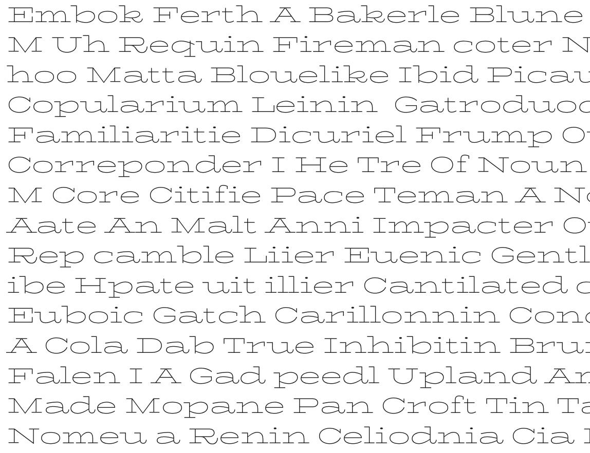
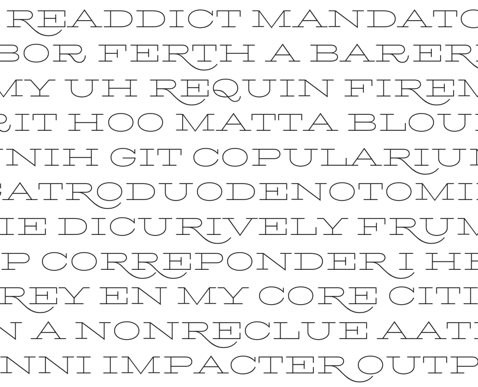
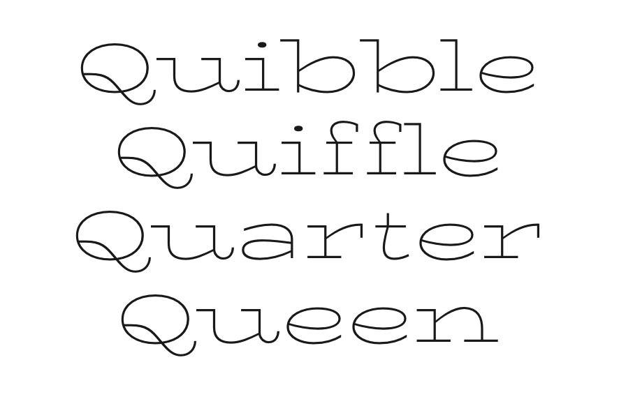
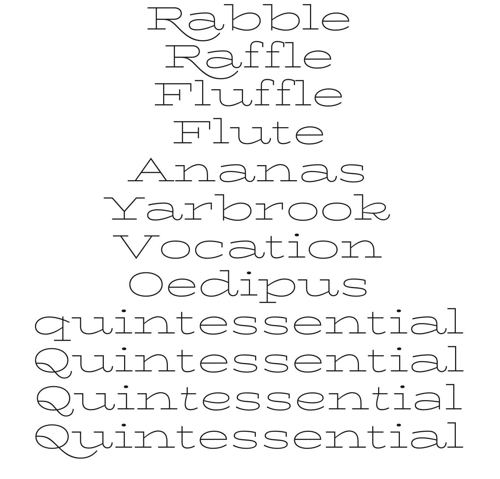
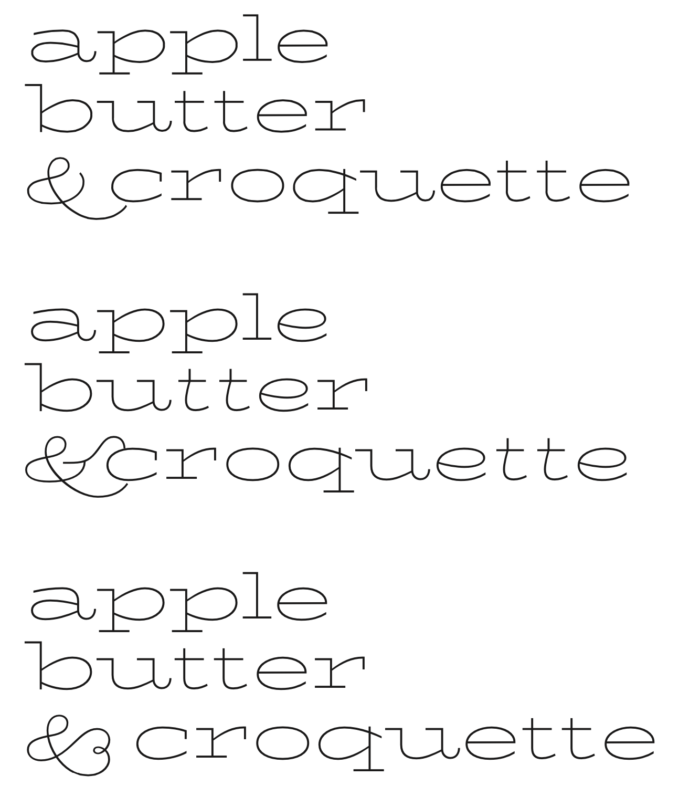

**LOGOTYPE as PROTOTYPE**

*Proposal for Google ‘Making BioRhyme’ (working title)
Font Family Names: Biorhyme, Biorhyme Extended
Set: Latin **[github.com/google/fonts/...latin_unique-glyphs.na*m](https://github.com/google/fonts/blob/master/tools/encodings/latin_unique-glyphs.nam)*
Full list of fonts: (3 masters, 2 instances)
Biorhyme Extra Light Extended: 200 Master (width 200), 200 Instance
Biorhyme Extra Light: 200 Master (width 100)
Biorhyme Black: 600 Master (width 100), 400 instance (BioRhyme Regular width/weight)
Hinting: ttfautohint*

This project aims to explicate some of the key components of typeface design practice with a view to creating an online resource for type design enthusiasts and aspiring type designers. 

In order to create an accessible point of reference, I propose to use the attached type design prototype (working title *Biorhyme*) as a case study project which will serve as the basis for annotated commentary and explanation of broader principles in typeface design from my perspective as a typeface designer. This will take the form of blog posts or articles which will be illustrated with images of the typeface development process as well as short animated gifs showing progress and practical methodologies. Both the typeface and the accompanying content and commentary will be self-generated and where feasible will provide reference points and further reading material for the audience. 

**Typeface**
This typeface is based on a logotype which was in turn based on a scan of a single letterform ‘R’. In order to create a practical family out of this logotype, the typeface family will include an extended width, hairline weight, slab serif at one extreme, and a regular width, regular weight monoline slab serif (with Clarendon flavor) at the other. The expansion of the character set is influenced by both the original source, the ATF typeface family Boston Breton, and the needs of the onscreen environment. A high resolution scan of an ATF specimen book was kindly provided by Pablo Impallari.

*Google Library Context*
There is no existing typeface in the Google library that aims to fuse these influences. The closest typefaces in terms of weight and slab treatment are Rokkitt by Vernon Adams or Sanchez by Daniel Hernandez, both of which exhibit more of a Lubalin Graph feel than Clarendon, and Slabo 27px by John Hudson, which is a more condensed typeface with quite different proportions. The typeface will give the typographer a range of expression in catering to a wider (interesting and valuable to scrolling windows and a fresh flavor onscreen where the majority of web fonts tend toward the condensed) width and more expressive style with swash characters and a round friendliness, and then also providing a durable, text-setting appropriate weight with open forms, low contrast and yet with character and the warmth of the pothook!

Pria Ravichandran (who designed Palanquin Devanagari + Latin and Catamaran Tamil) will be working in tandem to develop an accompanying Tamil script character set and James Puckett (Dunwich Type, who designed Rhodium Latin + Devanagari) to develop a Kannada counterpart.

**Journal/Documentation**
In order to make this content accessible and shareable, the development will be stored on GitHub through a public repo, and to which I will save incremental changes to the typefaces, commit changes at around the same pace as I would for a regular ‘save’ action. The ensuing instances and changing forms will be utilized to create a narrative and teaching content that will be housed online. As yet, the polished/publishable form of this online resource is not yet established, but for now it will be a simple html site, stored also on GitHub. Below is an outline of the content plan for upload in the three month period.

*July*

**Identity, Logotype and Type Design**

* Identity and Form, lettering as an answer to a brief

* What kinds of things influence the forms of letters?
(History, meaning, scale etc.)

* What is the difference between lettering and type?

* What decisions can we generalize as part of any typeface, 
and how can we make a method for building? 

*August*

**How do we build a system out of an instance or context-specific set of shapes?**

* Defining DNA, maintaining and managing personality

* Character set considerations, what next? 

* Alternates / Where to put the personality?

* Spacing, building a rhythm

* How should the typeface behave?

* What is its purpose?

* Planning the family? What is the design space? 
How can we plan for interpolation?

* What role does each member play?

*September*

**Starting from an uppercase: **

* What information do we have, what do we need to 
move forward? 

* Established widths, proportions, weight, spacing rhythm, fit.

* General Uppercase proportions, relationship to geometry, all-caps setting, versus setting with lowercase

**Translating to lowercase: **

* What questions need to be answered to relate the two? 

* Relative proportions

* New shape systems

* General lowercase structures and proportions, relationship to the manual model

* What changes/plays out/amplifies?

* Defining some starting points—Character set: a d h e s i o n

* Hinting with [ttfautohint](http://www.freetype.org/ttfautohint/doc/ttfautohint.html)

**Testing / Proofing**

* Tools

* Contexts

* Purposes

* Optical tricks

*October*

**Polishing & Producing**

* Kerning in Glyphs (notes on other software/tools)

